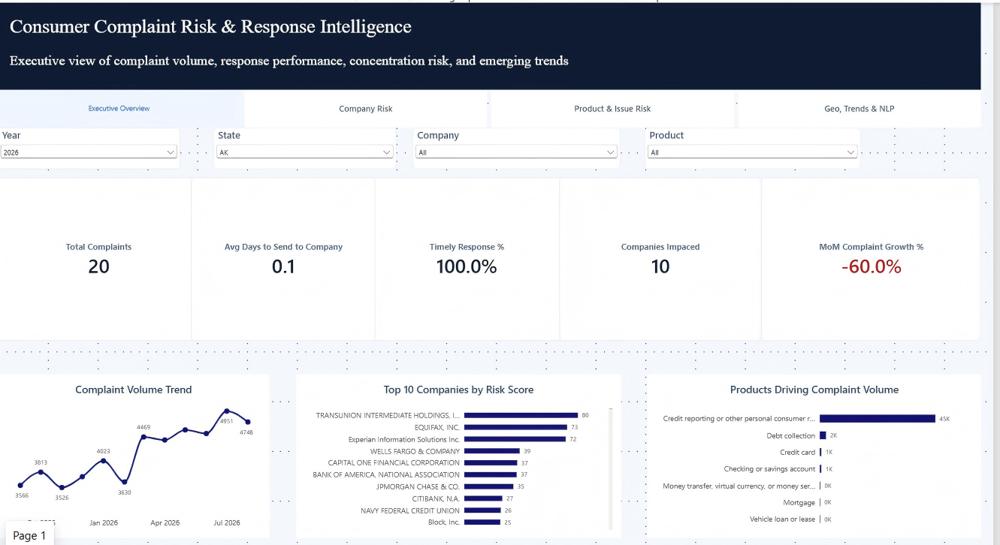
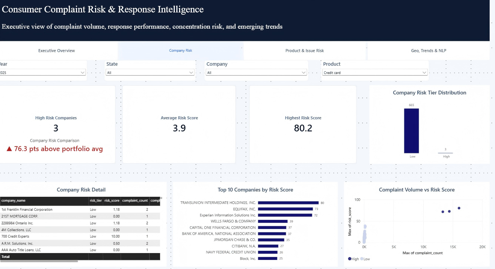
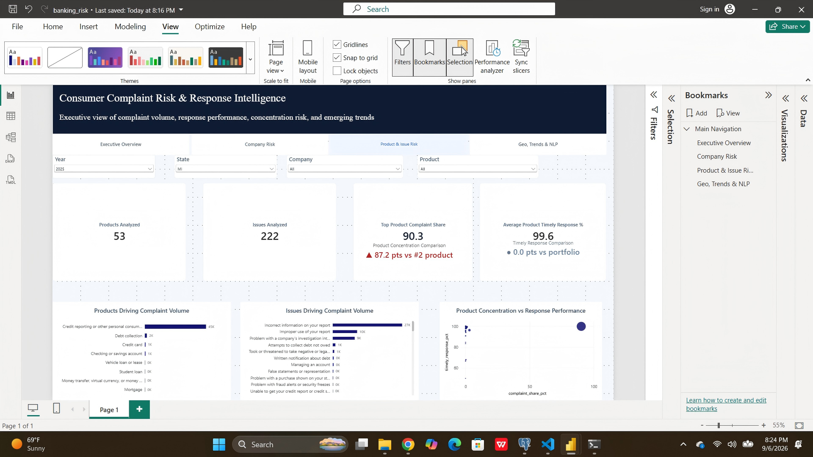
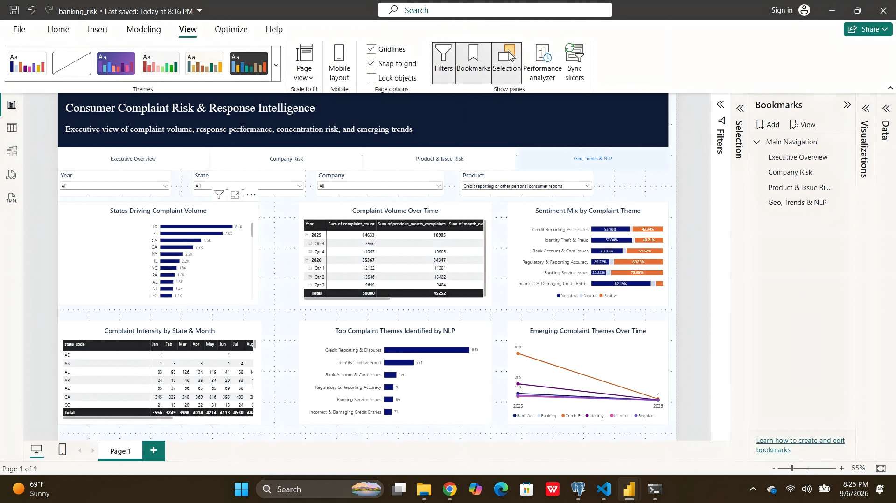

## Power BI Dashboard

The Power BI report contains four analytical views covering executive performance,
company-level risk, product and issue concentration, geographic trends, and NLP-driven
complaint intelligence.

### 1. Executive Overview

Provides an executive summary of complaint volume, response performance,
company exposure, month-over-month movement, and major complaint drivers.

---

### 2. Company Risk

Analyzes company-level risk using complaint volume, concentration,
response performance, and composite risk scoring.

---

### 3. Product & Issue Risk

Highlights product concentration, complaint-driving products and issues,
response performance, and portfolio-level comparisons.

---

### 4. Geo, Trends & NLP

Combines geographic complaint analysis with trend monitoring and NLP insights,
including complaint themes, sentiment analysis, and emerging narrative patterns.

